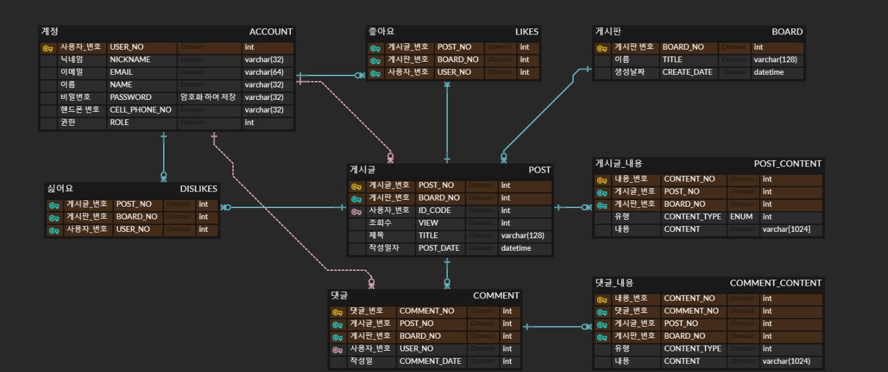

# My Test Board ERD

* 위의 이미지는 게시판을 만들기 위해 만든 ERD 다이어그램입니다.
* 개발 중 변동이 있을 가능성이 있습니다.

## 1. ACCOUNT 테이블
* 사용자 계정 정보를 갖는 테이블입니다.
* 관리자/일반 사용자를 구별하기 위해 권한 필드를 추가했습니다.

## 2. BOARD 테이블
* 특정 주제를 다루는 게시판들의 목록이 있는 테이블입니다.

## 3. POST 테이블
* 게시글들 목록이 있는 테이블입니다.
* 게시판 번호와 게시글 번호인 BOARD_NO, POST_NO 를 기본키로 갖습니다.

## 4. POST_CONTENT
* 게시글 내용들을 가지는 테이블입니다.
* 파일/문자열을 구분하기 위해 CONTENT_TYPE 필드를 가집니다.
* CONTENT는 파일인 경우 파일의 경로를 갖게되며 문자열인 경우 문자열을 갖습니다.
* 게시판 번호, 게시글 번호, 내용 번호인 (BOARD_NO, POST_NO, CONTENT_NO) 기본키로 가집니다.

## 5. LIKES
* 게시글의 좋아요를 위해 만든 테이블입니다.
* 사용자 번호, 게시판 번호, 게시글 번호인 USER_NO, BOARD_NO, POST_NO를 기본키로 가집니다.

## 6. DISLIKES
* 게시글의 싫어요를 위해 만든 테이블입니다.
* 좋아요와 동일한 구조로 사용자 번호, 게시판 번호, 게시글 번호인 USER_NO, BOARD_NO, POST_NO를 기본키로 가집니다.

## 7. COMMENT
* 게시글의 댓글을 위해 만든 테이블입니다.
* 게시판 번호, 게시글 번호, 댓글 번호 인 BOARD_NO, POST_NO, COMMENT_NO를 기본키로 갖습니다.

## 8. COMMENT_CONTENT
* 댓글의 내용들을 가지는 테이블입니다.
* 게시판 번호, 게시글 번호, 댓글 번호, 내용 번호 (BOARD_NO, POST_NO, COMMENT_NO, CONTENT_NO)를 기본키로 가집니다.